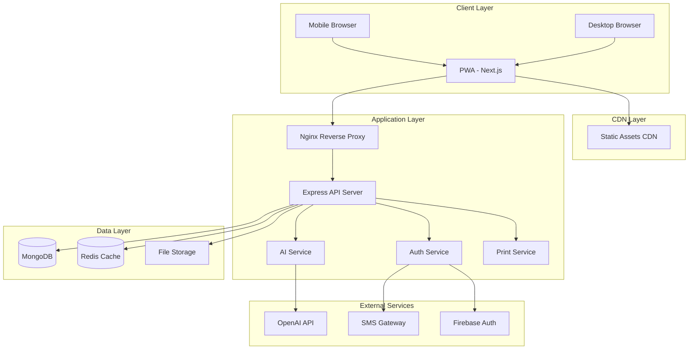
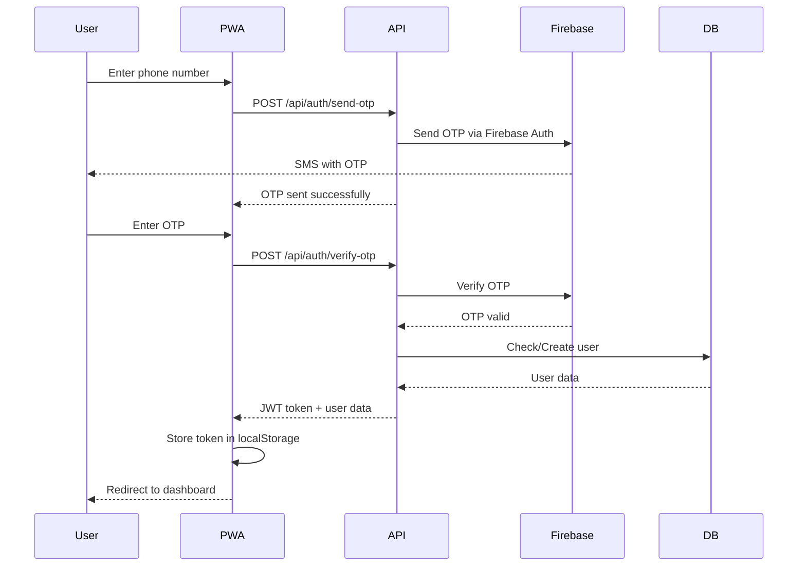
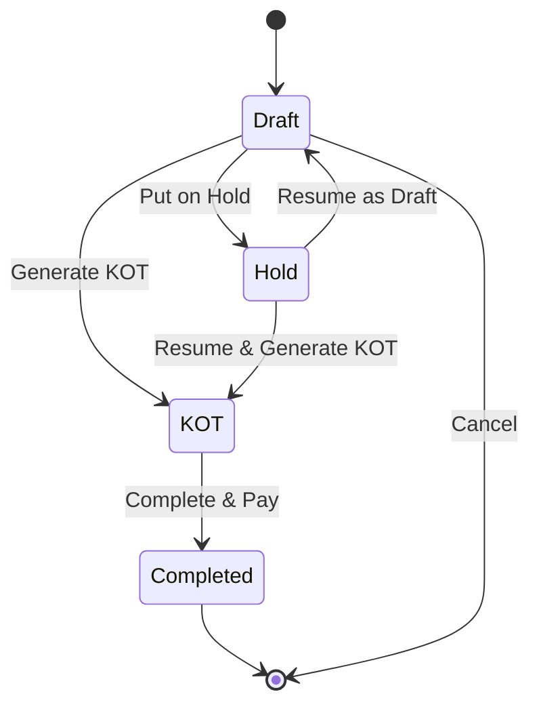

# Restaurant POS System - System Architecture Document

## 1. Executive Summary

A comprehensive mobile-first Progressive Web Application (PWA) for restaurant point-of-sale management with AI-powered features, multi-outlet support, and extensive reporting capabilities.

## 2. Technology Stack

### Frontend

- **Framework**: Next.js 14 (App Router)
- **UI Library**: React 18
- **Styling**: Tailwind CSS + shadcn/ui components
- **State Management**: Zustand (lightweight and performant)
- **Forms**: React Hook Form + Zod validation
- **PWA**: next-pwa for offline support
- **QR Code**: qrcode.react for UPI QR generation
- **Charts**: Recharts for analytics visualization
- **Icons**: Lucide React
- **PDF Generation**: jsPDF + html2canvas
- **Excel Export**: xlsx library

### Backend

- **Runtime**: Node.js 20 LTS
- **Framework**: Express.js
- **Language**: TypeScript
- **Database**: MongoDB with Mongoose ODM
- **Authentication**: JWT + Custom OTP system (SMS via free providers)
- **File Upload**: Multer + Sharp (image processing)
- **AI Integration**: OpenAI API (DALL-E 3 for images, GPT-4 for descriptions)
- **Caching**: Redis (optional, for performance)
- **Queue**: Bull (for background jobs like AI generation)

### DevOps & Deployment

- **Web Server**: Nginx (reverse proxy)
- **Process Manager**: PM2
- **SSL**: Let's Encrypt (Certbot)
- **Monitoring**: PM2 + Custom logging
- **Backup**: Automated MongoDB backups

### Free OTP Solution

- **Primary**: Firebase Authentication (free tier - 10k verifications/month)
- **Fallback**: Custom implementation with email-based OTP as backup
- **SMS Gateway**: Integration with free tier services like:
  - Twilio (trial credits)
  - MSG91 (limited free SMS)
  - Email OTP as alternative for staff login

## 3. System Architecture



## 4. Database Schema Design

### 4.1 Users Collection

```javascript
{
  _id: ObjectId,
  phone: String (unique, indexed),
  name: String,
  email: String (optional),
  role: String (enum: ['owner', 'manager', 'staff']),
  outlets: [ObjectId], // Array of outlet IDs user has access to
  currentOutlet: ObjectId, // Currently selected outlet
  isActive: Boolean,
  createdAt: Date,
  updatedAt: Date
}
```

### 4.2 Outlets Collection

```javascript
{
  _id: ObjectId,
  ownerId: ObjectId (ref: Users),
  businessName: String,
  logo: String (URL),
  address: {
    street: String,
    city: String,
    state: String,
    pincode: String,
    country: String
  },
  contact: {
    phone: String,
    email: String
  },
  gstDetails: {
    gstin: String,
    isGstEnabled: Boolean
  },
  upiDetails: {
    upiId: String,
    qrCodeUrl: String
  },
  settings: {
    currency: String (default: 'INR'),
    taxRate: Number,
    kotPrinterEnabled: Boolean,
    billPrinterEnabled: Boolean
  },
  isActive: Boolean,
  createdAt: Date,
  updatedAt: Date
}
```

### 4.3 Categories Collection

```javascript
{
  _id: ObjectId,
  outletId: ObjectId (ref: Outlets, indexed),
  name: String,
  icon: String,
  displayOrder: Number,
  isActive: Boolean,
  createdAt: Date,
  updatedAt: Date
}
```

### 4.4 Items Collection

```javascript
{
  _id: ObjectId,
  outletId: ObjectId (ref: Outlets, indexed),
  name: String,
  description: String,
  category: ObjectId (ref: Categories),
  price: Number,
  image: {
    url: String,
    isAiGenerated: Boolean,
    aiPrompt: String (if AI generated)
  },
  tax: {
    isApplicable: Boolean,
    rate: Number,
    type: String (enum: ['percentage', 'fixed'])
  },
  isFavourite: Boolean,
  isAvailable: Boolean,
  isActive: Boolean,
  inventory: {
    trackInventory: Boolean,
    currentStock: Number,
    lowStockAlert: Number
  },
  createdAt: Date,
  updatedAt: Date
}
```

### 4.5 Orders Collection

```javascript
{
  _id: ObjectId,
  outletId: ObjectId (ref: Outlets, indexed),
  orderNumber: String (unique per outlet),
  orderType: String (enum: ['dine-in', 'takeaway', 'delivery']),
  status: String (enum: ['draft', 'kot', 'hold', 'completed', 'cancelled']),
  items: [{
    itemId: ObjectId (ref: Items),
    name: String, // Snapshot
    price: Number, // Snapshot
    quantity: Number,
    tax: Number,
    subtotal: Number,
    notes: String
  }],
  customer: {
    customerId: ObjectId (ref: Customers, optional),
    name: String,
    phone: String,
    address: String
  },
  pricing: {
    subtotal: Number,
    taxAmount: Number,
    discount: Number,
    total: Number
  },
  payment: {
    method: String (enum: ['cash', 'upi', 'phonepe', 'googlepay', 'card']),
    status: String (enum: ['pending', 'paid', 'partial']),
    paidAmount: Number,
    changeAmount: Number
  },
  kot: {
    kotNumber: String,
    kotTime: Date,
    isPrinted: Boolean
  },
  invoice: {
    invoiceNumber: String,
    invoiceTime: Date,
    isPrinted: Boolean
  },
  createdBy: ObjectId (ref: Users),
  completedAt: Date,
  createdAt: Date,
  updatedAt: Date
}
```

### 4.6 Customers Collection

```javascript
{
  _id: ObjectId,
  outletId: ObjectId (ref: Outlets, indexed),
  name: String,
  phone: String (indexed),
  email: String,
  address: String,
  notes: String,
  totalOrders: Number,
  totalSpent: Number,
  lastOrderDate: Date,
  tags: [String], // ['regular', 'vip', etc.]
  isActive: Boolean,
  createdAt: Date,
  updatedAt: Date
}
```

### 4.7 Expenses Collection

```javascript
{
  _id: ObjectId,
  outletId: ObjectId (ref: Outlets, indexed),
  category: String (enum: ['inventory', 'salary', 'rent', 'utilities', 'other']),
  description: String,
  amount: Number,
  date: Date (indexed),
  paymentMethod: String,
  receipt: String (URL, optional),
  createdBy: ObjectId (ref: Users),
  createdAt: Date,
  updatedAt: Date
}
```

### 4.8 Inventory Collection

```javascript
{
  _id: ObjectId,
  outletId: ObjectId (ref: Outlets, indexed),
  itemId: ObjectId (ref: Items, optional),
  rawMaterialName: String,
  quantity: Number,
  unit: String (enum: ['kg', 'ltr', 'pcs', 'pkt']),
  minStockLevel: Number,
  lastRestocked: Date,
  supplier: {
    name: String,
    contact: String
  },
  cost: Number,
  isActive: Boolean,
  createdAt: Date,
  updatedAt: Date
}
```

### 4.9 Reports Cache Collection

```javascript
{
  _id: ObjectId,
  outletId: ObjectId (ref: Outlets, indexed),
  reportType: String (enum: ['daily', 'weekly', 'monthly']),
  date: Date (indexed),
  data: Mixed, // Cached aggregated data
  generatedAt: Date,
  expiresAt: Date
}
```

## 5. API Endpoints Specification

### 5.1 Authentication APIs

```
POST   /api/auth/send-otp          - Send OTP to phone number
POST   /api/auth/verify-otp        - Verify OTP and login
POST   /api/auth/refresh           - Refresh JWT token
POST   /api/auth/logout            - Logout user
GET    /api/auth/me                - Get current user details
```

### 5.2 Outlet Management APIs

```
GET    /api/outlets                - Get all outlets for user
POST   /api/outlets                - Create new outlet
GET    /api/outlets/:id            - Get outlet details
PUT    /api/outlets/:id            - Update outlet
DELETE /api/outlets/:id            - Delete outlet
POST   /api/outlets/:id/select     - Select outlet as current
PUT    /api/outlets/:id/logo       - Upload outlet logo
```

### 5.3 Category APIs

```
GET    /api/categories             - Get all categories
POST   /api/categories             - Create category
PUT    /api/categories/:id         - Update category
DELETE /api/categories/:id         - Delete category
PUT    /api/categories/reorder     - Reorder categories
```

### 5.4 Item Management APIs

```
GET    /api/items                  - Get all items (with filters)
POST   /api/items                  - Create item
GET    /api/items/:id              - Get item details
PUT    /api/items/:id              - Update item
DELETE /api/items/:id              - Delete item
POST   /api/items/:id/image        - Upload item image
POST   /api/items/:id/generate-image - Generate AI image
PUT    /api/items/:id/toggle-favourite - Toggle favourite
PUT    /api/items/:id/toggle-availability - Toggle availability
```

### 5.5 Order Management APIs

```
GET    /api/orders                 - Get orders (with filters)
POST   /api/orders                 - Create order
GET    /api/orders/:id             - Get order details
PUT    /api/orders/:id             - Update order
DELETE /api/orders/:id             - Delete order
POST   /api/orders/:id/kot         - Generate KOT
POST   /api/orders/:id/hold        - Hold order
POST   /api/orders/:id/complete    - Complete order
POST   /api/orders/:id/invoice     - Generate invoice
GET    /api/orders/:id/print-kot   - Get KOT for printing
GET    /api/orders/:id/print-invoice - Get invoice for printing
```

### 5.6 Customer Management APIs

```
GET    /api/customers              - Get all customers
POST   /api/customers              - Create customer
GET    /api/customers/:id          - Get customer details
PUT    /api/customers/:id          - Update customer
DELETE /api/customers/:id          - Delete customer
GET    /api/customers/search       - Search customers by phone/name
```

### 5.7 Reports APIs

```
GET    /api/reports/dashboard      - Dashboard overview
GET    /api/reports/sales          - Sales report (date range)
GET    /api/reports/items          - Item-wise sales
GET    /api/reports/orders         - Order list report
GET    /api/reports/customers      - Customer report
GET    /api/reports/expenses       - Expense report
POST   /api/reports/export-pdf     - Export report as PDF
POST   /api/reports/export-excel   - Export report as Excel
```

### 5.8 Expense Management APIs

```
GET    /api/expenses               - Get all expenses
POST   /api/expenses               - Create expense
PUT    /api/expenses/:id           - Update expense
DELETE /api/expenses/:id           - Delete expense
POST   /api/expenses/:id/receipt   - Upload receipt
```

### 5.9 Inventory APIs

```
GET    /api/inventory              - Get inventory items
POST   /api/inventory              - Add inventory item
PUT    /api/inventory/:id          - Update inventory
DELETE /api/inventory/:id          - Delete inventory item
GET    /api/inventory/low-stock    - Get low stock alerts
```

### 5.10 AI Integration APIs

```
POST   /api/ai/generate-image      - Generate food image from description
POST   /api/ai/enhance-description - Enhance item description
```

## 6. Authentication Flow



## 7. Order Flow



## 8. Feature Modules Breakdown

### 8.1 Authentication Module

**Files Structure:**

```
frontend/
  src/
    app/
      (auth)/
        login/
          page.tsx
        verify/
          page.tsx
    components/
      auth/
        OTPInput.tsx
        PhoneInput.tsx
    store/
      authStore.ts
    hooks/
      useAuth.ts

backend/
  src/
    controllers/
      authController.ts
    services/
      authService.ts
      otpService.ts
    middleware/
      authMiddleware.ts
    models/
      User.ts
```

**Key Features:**

- Phone number validation
- OTP generation and verification
- JWT token management
- Session persistence
- Role-based access control

### 8.2 Multi-Outlet Module

**Files Structure:**

```
frontend/
  src/
    app/
      dashboard/
        outlets/
          page.tsx
          [id]/
            page.tsx
            edit/
              page.tsx
    components/
      outlets/
        OutletCard.tsx
        OutletForm.tsx
        OutletSelector.tsx
    store/
      outletStore.ts

backend/
  src/
    controllers/
      outletController.ts
    services/
      outletService.ts
    models/
      Outlet.ts
```

**Key Features:**

- Create/Edit outlet with business details
- Upload and manage outlet logo
- Switch between outlets
- Outlet-specific data isolation
- UPI QR code generation

### 8.3 Item Management Module

**Files Structure:**

```
frontend/
  src/
    app/
      dashboard/
        items/
          page.tsx
          create/
            page.tsx
          [id]/
            edit/
              page.tsx
    components/
      items/
        ItemCard.tsx
        ItemForm.tsx
        ItemGrid.tsx
        AIImageGenerator.tsx
        CategoryFilter.tsx

backend/
  src/
    controllers/
      itemController.ts
      categoryController.ts
    services/
      itemService.ts
      aiImageService.ts
    models/
      Item.ts
      Category.ts
```

**Key Features:**

- CRUD operations for items
- Category management
- AI image generation via OpenAI DALL-E
- Manual image upload with compression
- Favourite items toggle
- Availability management
- Price and tax configuration

### 8.4 Order & KOT Module

**Files Structure:**

```
frontend/
  src/
    app/
      dashboard/
        orders/
          page.tsx
          new/
            page.tsx
          [id]/
            page.tsx
        kot/
          page.tsx
    components/
      orders/
        OrderForm.tsx
        ItemSelector.tsx
        QuantityControl.tsx
        OrderSummary.tsx
        KOTPreview.tsx
        HoldOrders.tsx

backend/
  src/
    controllers/
      orderController.ts
    services/
      orderService.ts
      kotService.ts
    models/
      Order.ts
```

**Key Features:**

- Visual item selection with images
- Category-based filtering
- Quantity adjustment controls
- Real-time price calculation
- KOT generation
- Order hold/resume functionality
- Order history

### 8.5 Billing & Invoice Module

**Files Structure:**

```
frontend/
  src/
    app/
      dashboard/
        billing/
          [orderId]/
            page.tsx
    components/
      billing/
        InvoiceForm.tsx
        InvoicePreview.tsx
        PaymentMethodSelector.tsx
        QRCodeDisplay.tsx
        PrintButton.tsx

backend:
  src/
    controllers/
      billingController.ts
    services/
      invoiceService.ts
      pdfService.ts
    templates/
      invoice.html
```

**Key Features:**

- Customer details capture
- Itemized billing
- Tax calculation
- Multiple payment methods
- UPI QR code display
- Invoice preview
- Print functionality
- Invoice number generation

### 8.6 Customer Management Module

**Files Structure:**

```
frontend/
  src/
    app/
      dashboard/
        customers/
          page.tsx
          create/
            page.tsx
          [id]/
            page.tsx
    components/
      customers/
        CustomerList.tsx
        CustomerForm.tsx
        CustomerCard.tsx
        CustomerSearch.tsx

backend/
  src/
    controllers/
      customerController.ts
    services/
      customerService.ts
    models/
      Customer.ts
```

**Key Features:**

- Customer database
- Quick search by name/phone
- Order history per customer
- Marketing contact list
- Customer analytics

### 8.7 Reports & Analytics Module

**Files Structure:**

```
frontend/
  src/
    app/
      dashboard/
        reports/
          page.tsx
          sales/
            page.tsx
          items/
            page.tsx
          orders/
            page.tsx
    components/
      reports/
        DashboardCards.tsx
        SalesChart.tsx
        ItemReport.tsx
        OrderReport.tsx
        DateRangePicker.tsx
        ExportButtons.tsx

backend/
  src/
    controllers/
      reportController.ts
    services/
      reportService.ts
      exportService.ts
```

**Key Features:**

- Dashboard overview
- Today's sales vs yesterday
- Item-wise sales report
- Order transaction list
- Payment method filtering
- Customer filtering
- Date range selection
- PDF export
- Excel export

### 8.8 Expense Management Module

**Files Structure:**

```
frontend/
  src/
    app/
      dashboard/
        expenses/
          page.tsx
          create/
            page.tsx
    components/
      expenses/
        ExpenseList.tsx
        ExpenseForm.tsx
        ExpenseCard.tsx

backend/
  src/
    controllers/
      expenseController.ts
    services/
      expenseService.ts
    models/
      Expense.ts
```

**Key Features:**

- Record daily expenses
- Categorize expenses
- Receipt upload
- Expense analytics
- Monthly expense tracking

### 8.9 Printer Integration Module

**Files Structure:**

```
frontend/
  src/
    utils/
      printer/
        printService.ts
        kotTemplate.ts
        invoiceTemplate.ts
    components/
      printer/
        PrinterStatus.tsx
        PrintPreview.tsx

backend/
  src/
    services:
      printerService.ts
```

**Key Features:**

- ESC/POS printer support
- Thermal printer integration
- Print preview
- Offline status indication
- Network printer support
- Bluetooth printer support (PWA)

## 9. UI/UX Design - Mobile First

### 9.1 Bottom Navigation

```
┌─────────────────────────────────────┐
│                                     │
│         Content Area                │
│                                     │
│                                     │
└─────────────────────────────────────┘
┌─────────────────────────────────────┐
│ 🏠     📦    ➕     📊     ☰      │
│Home   Items  Add   Reports More     │
└─────────────────────────────────────┘
```

### 9.2 Key Screens

**Home Dashboard:**

- Business overview cards (Today's sales, orders)
- Quick actions (New Order, View KOTs)
- Recent orders
- Low stock alerts

**Items Screen:**

- Category filter tabs (horizontal scroll)
- Grid view of items with images
- Quick add to order button
- Search and filter

**Add Order Screen:**

- Item selector with images
- Selected items list with quantity controls
- Running total
- KOT, Hold, Complete buttons

**Reports Screen:**

- Tab navigation (Sales, Items, Orders)
- Date range selector
- Charts and graphs
- Export options

**More Screen:**

- Outlet selector
- Settings
- Customers
- Expenses
- Inventory
- Profile
- Logout

### 9.3 Design System

```
Colors:
- Primary: #3B82F6 (Blue)
- Secondary: #10B981 (Green)
- Accent: #F59E0B (Orange)
- Success: #10B981
- Error: #EF4444
- Warning: #F59E0B
- Background: #F9FAFB
- Surface: #FFFFFF
- Text Primary: #111827
- Text Secondary: #6B7280

Typography:
- Headings: Inter (Bold)
- Body: Inter (Regular)
- Monospace: JetBrains Mono (for numbers)

Spacing Scale:
- xs: 4px
- sm: 8px
- md: 16px
- lg: 24px
- xl: 32px
- 2xl: 48px
```

## 10. Security Measures

### 10.1 Authentication Security

- JWT tokens with short expiry (1 hour)
- Refresh tokens (7 days)
- Secure HTTP-only cookies
- CORS configuration
- Rate limiting on auth endpoints
- Phone number validation
- OTP expiry (5 minutes)

### 10.2 API Security

- JWT verification middleware
- Role-based access control
- Input validation and sanitization
- SQL injection prevention (Mongoose)
- XSS protection
- HTTPS enforcement
- Request rate limiting
- File upload validation

### 10.3 Data Security

- Encrypted database connections
- Regular backups
- Data isolation per outlet
- Soft deletes for critical data
- Audit logs for sensitive operations
- Password hashing (bcrypt)
- Secure file storage

### 10.4 PWA Security

- Service Worker security
- Secure offline storage
- Content Security Policy
- HTTPS requirement
- Token refresh mechanism

## 11. Performance Optimization

### 11.1 Frontend Optimization

- Next.js App Router with RSC
- Image optimization (next/image)
- Code splitting
- Lazy loading
- Service Worker caching
- Optimistic UI updates
- Debounced search
- Virtual scrolling for long lists

### 11.2 Backend Optimization

- MongoDB indexes on frequent queries
- Redis caching for reports
- Background jobs for AI generation
- Connection pooling
- Query optimization
- Pagination for large datasets
- Compression (gzip)

### 11.3 Database Optimization

```javascript
// Indexes
db.orders.createIndex({ outletId: 1, createdAt: -1 });
db.orders.createIndex({ outletId: 1, status: 1 });
db.orders.createIndex({ "customer.phone": 1 });
db.items.createIndex({ outletId: 1, category: 1 });
db.items.createIndex({ outletId: 1, isFavourite: 1 });
db.customers.createIndex({ outletId: 1, phone: 1 });
```

## 12. Deployment Strategy

### 12.1 VPS Setup

```bash
# Server specifications
- OS: Ubuntu 22.04 LTS
- RAM: Minimum 2GB
- Storage: 20GB SSD
- Node.js: 20 LTS
- MongoDB: 7.0
- Nginx: Latest stable
- PM2: Latest
```

### 12.2 Deployment Steps

```bash
# 1. Setup Node.js and MongoDB
curl -fsSL https://deb.nodesource.com/setup_20.x | sudo -E bash -
sudo apt install -y nodejs mongodb-org

# 2. Setup Nginx
sudo apt install nginx
sudo systemctl enable nginx

# 3. Install PM2
sudo npm install -g pm2

# 4. Clone and setup application
git clone <repository>
cd restaurant-pos
npm install
npm run build

# 5. Setup environment variables
cp .env.example .env
# Edit .env with production values

# 6. Start application with PM2
pm2 start ecosystem.config.js
pm2 save
pm2 startup

# 7. Setup Nginx reverse proxy
sudo nano /etc/nginx/sites-available/restaurant-pos
# Configure Nginx
sudo ln -s /etc/nginx/sites-available/restaurant-pos /etc/nginx/sites-enabled/
sudo nginx -t
sudo systemctl reload nginx

# 8. Setup SSL with Let's Encrypt
sudo apt install certbot python3-certbot-nginx
sudo certbot --nginx -d yourdomain.com
```

### 12.3 Environment Variables

```env
# App
NODE_ENV=production
PORT=3000
API_URL=https://api.yourdomain.com

# Database
MONGODB_URI=mongodb://localhost:27017/restaurant_pos
REDIS_URL=redis://localhost:6379

# Authentication
JWT_SECRET=your-super-secret-jwt-key
JWT_EXPIRES_IN=1h
REFRESH_TOKEN_SECRET=your-refresh-token-secret
REFRESH_TOKEN_EXPIRES_IN=7d

# Firebase (for OTP)
FIREBASE_PROJECT_ID=your-project-id
FIREBASE_PRIVATE_KEY=your-private-key
FIREBASE_CLIENT_EMAIL=your-client-email

# OpenAI
OPENAI_API_KEY=your-openai-api-key

# File Upload
MAX_FILE_SIZE=5242880 # 5MB
UPLOAD_PATH=/var/www/uploads

# Email (backup for OTP)
SMTP_HOST=smtp.gmail.com
SMTP_PORT=587
SMTP_USER=your-email@gmail.com
SMTP_PASS=your-app-password
```

### 12.4 Backup Strategy

```bash
# MongoDB backup script
#!/bin/bash
BACKUP_DIR="/var/backups/mongodb"
DATE=$(date +%Y%m%d_%H%M%S)
mongodump --out=$BACKUP_DIR/$DATE
find $BACKUP_DIR -type d -mtime +7 -exec rm -rf {} +

# Cron job for daily backups
0 2 * * * /usr/local/bin/mongodb-backup.sh
```

### 12.5 Monitoring

```bash
# PM2 monitoring
pm2 monit

# Check logs
pm2 logs

# Application health check endpoint
GET /api/health

# Response
{
  "status": "ok",
  "database": "connected",
  "timestamp": "2024-01-01T00:00:00.000Z"
}
```

## 13. Testing Strategy

### 13.1 Frontend Testing

- Unit tests: Jest + React Testing Library
- E2E tests: Playwright
- Visual regression: Chromatic (optional)

### 13.2 Backend Testing

- Unit tests: Jest
- Integration tests: Supertest
- Load testing: k6 (optional)

### 13.3 Test Coverage Goals

- Unit tests: 80%+
- API tests: 90%+
- Critical paths: 100%

## 14. Future Enhancements

### Phase 2

- Multi-language support
- Dark mode
- Table management
- Reservation system
- Loyalty program
- SMS notifications

### Phase 3

- Mobile app (React Native)
- Kitchen display system
- Staff attendance
- Recipe management
- Supplier management
- Advanced analytics with ML

### Phase 4

- Online ordering integration
- Delivery management
- Fleet tracking
- Multi-currency support
- Franchise management

## 15. Project Timeline Estimate

### Sprint 1 (2 weeks)

- Project setup and configuration
- Authentication system
- Basic UI components

### Sprint 2 (2 weeks)

- Outlet management
- Item management
- Category management

### Sprint 3 (2 weeks)

- Order management
- KOT system
- Basic reporting

### Sprint 4 (2 weeks)

- Billing and invoicing
- Payment integration
- Customer management

### Sprint 5 (2 weeks)

- Advanced reports
- AI integration
- Printer integration

### Sprint 6 (1 week)

- Testing and bug fixes
- Performance optimization
- Documentation

### Sprint 7 (1 week)

- Deployment
- Training
- Go-live support

**Total Estimated Time: 11-12 weeks**

## 16. Cost Estimation

### Development Costs

- Frontend development: 150-200 hours
- Backend development: 120-150 hours
- UI/UX design: 40-60 hours
- Testing: 40-50 hours
- Deployment: 10-15 hours

### Infrastructure Costs (Monthly)

- VPS (2GB RAM): $10-20
- Domain: $1-2
- SSL Certificate: Free (Let's Encrypt)
- OpenAI API: $20-50 (depends on usage)
- Firebase Auth: Free tier (up to 10k verifications)
- Backups: $5-10
- **Total: ~$36-82/month**

### One-time Costs

- Domain registration: $10-15/year
- Logo design (optional): $50-100
- Initial setup: Included in development

## 17. Maintenance Plan

### Daily Tasks

- Monitor application health
- Check error logs
- Verify backups

### Weekly Tasks

- Review performance metrics
- Check disk space
- Update security patches

### Monthly Tasks

- Database optimization
- Clean old logs
- Review and archive old data
- Cost analysis

### Quarterly Tasks

- Feature updates
- Security audit
- Performance optimization
- User feedback review

---

## Document Version

- Version: 1.0
- Last Updated: 2025-01-07
- Next Review: 2025-02-07
